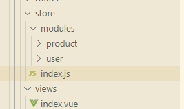

# vue-vuex-project

> A Vue.js project

## Build Setup

``` bash
# install dependencies
npm install

#依赖库的打包抽离
npm run dll

# serve with hot reload at localhost:8080
npm run dev

# build for production with minification
npm run build

# build for production and view the bundle analyzer report
npm run build --report

```

##  **一、vuex 简单起步**

&emsp;&emsp;1、实例一个控制对话框状态( ./store/index.js )
```
    export default new Vuex.Store({
        state:{
            isDialogVisible : false,
        },
        actions:{
        },
        mutations:{
            toggleDialogHandle(state){
                state.isDialogVisible = !state.isDialogVisible;
            },

        }
    })
```
&emsp;&emsp;2、在对话框组件中直接监听绑定
```
    <el-dialog
      :visible.sync="getDialogVisible"//组件中直接绑定
    
    ...
    ...

    computed:{
        getDialogVisible(){
            return this.$store.state.isDialogVisible;
        }
    }

    ...
    ...
```

##  **二、复杂项目中 vuex 的module使用**
&emsp;&emsp;1、store入口修改( ./store/index.js )<br>

目录结构<br>


```
    import userStore from './modules/user'

    export default new Vuex.Store({
        modules: {
            userStore
        }
    })
```
&emsp;&emsp;2、想要改变组件中某一个值（username），首先通过dispatch触发，，然后调用action(异步)中的方法（这里说明下使用module的命名空间，详情：[VUEX官网](https://vuex.vuejs.org/zh/guide/modules.html)）<br>
```
    this.$store.dispatch( 'userStore/changUsernameAsyncHandle', { name: "更新用户名" });
```
&emsp;&emsp;3、action 通过提交（commit）mutation，从而修改state

```
    const userActions = {
        changUsernameAsyncHandle (context, payload){
            context.commit('changUsernameHandle', payload);
        }
    }

    export default userActions;

    ---

    const userMutations = {
        changUsernameHandle(state, payload){
            state.username = payload.name
        }
    }
    export default userMutations;
```
&emsp;&emsp;4、组件中通过computed计算属性，更新state
```
    computed:{
        getUsername(){
            return this.$store.state.userStore.username;
        },
    }
```
##  **三、项目打包的优化处理**
#### &emsp;&emsp;1、初始化之后打包

#### &emsp;&emsp;2、引入element-ui之后打包（app.css、vendor.js都有明显增加），后期开发中我们还要引入各种依赖包，这样会使我们打包速度越来越慢


#### &emsp;&emsp;3、webpack提供一个依赖包分离的插件dllplugin，把所有依赖库第一次先打成一个包，，在后期打包过程中只要依赖库没有更新，我们就不需要再次打包（dll.vendor_148aef.js）,这样我们代码打包文件就小很多了


##  **四、dllplugin配置**
#### &emsp;&emsp;1、配置一份webpack.dll.config.js文件
```
    const path = require('path')
    const webpack = require('webpack')
    const AssetsPlugin = require('assets-webpack-plugin')
    const { CleanWebpackPlugin } = require("clean-webpack-plugin")//清除历史打包文件

    module.exports = {
        entry:{
            vendor: ['vue', 'vue-router', 'vuex', 'axios', 'element-ui', ],
        },
        output: {
            path: path.join(__dirname, '../static'),
            filename: 'dll.[name]_[hash:6].js',
            library: '[name]_[hash:6]'
        },
        plugins: [
        new webpack.DllPlugin({
            path: path.join(__dirname, '../', '[name]-manifest.json'),
            name: '[name]_[hash:6]'
        }),
        // 把带hash的dll插入到html中
        new AssetsPlugin({
            filename: 'bundle-config.json',
            path: './'
        }),
        //打包之前清除目录名
        new CleanWebpackPlugin(),
    
        ]
    }
```
#### &emsp;&emsp;2、同及目录建一个运行打包的dll.js文件
```
    var ora = require('ora')
    var chalk = require('chalk')
    var webpack = require('webpack')
    var webpackConfig = require('./webpack.dll.conf')

    var spinner = ora('building for dependencies...')
    spinner.start()

    webpack(webpackConfig, function (err, stats) {
        spinner.stop()
        if (err) throw err
        process.stdout.write(stats.toString({
        colors: true,
        modules: false,
        children: false,
        chunks: false,
        chunkModules: false
        }) + '\n\n')
    
        console.log(chalk.cyan('  Build complete.\n'))
    })
```
#### &emsp;&emsp;3、在webpack.base.conf.js中增加一行代码，用来同步连接打包的依赖库资源
```
    new DllReferencePlugin({
        // 描述 vue、element-ui等 动态链接库的文件内容
        manifest: require('../dist/site/vendor-manifest.json'),
    })
```
#### &emsp;&emsp;4、在模版html文件中引入文件
手动引入：```<script src="./dll_vendor.js"></script>```，适用于无hash值的文件；

动态引入：```<script src="./static/<%= htmlWebpackPlugin.options.vendorJsName %>"></script>```,还需分别在dev.conf.js和pro.conf.js中添加配置```vendorJsName: bundleConfig.vendor.js,```
```
    new HtmlWebpackPlugin({
        ...
      vendorJsName: bundleConfig.vendor.js,
    }),
```